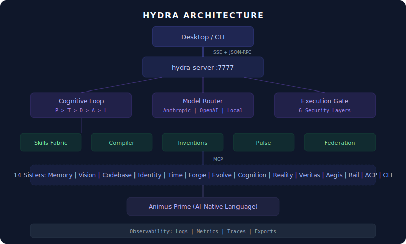

<div align="center">
  

  # Hydra

  **Universal AI Agent Orchestration Layer**

  <br/>

  
  &nbsp;
  
  &nbsp;
  
  &nbsp;
  

  <br/><br/>

  *Cognitive orchestration for AI agents. 14 sisters. 1,395 tests. Zero-compromise safety.*

</div>

---

## What is Hydra?

Hydra is the orchestration layer for the [Agentra](https://agentra.dev) ecosystem. It coordinates 14 specialized AI "sisters" (memory, vision, codebase, identity, and more) through a 5-phase cognitive loop, routes tasks to the right LLM, enforces safety gates, tracks every action with cryptographic receipts, and runs on 256 MB RAM.

<div align="center">
   Think > Decide > Act > Learn" />
</div>

## Features

- **Cognitive Loop** — PERCEIVE > THINK > DECIDE > ACT > LEARN with real LLM integration
- **14 Sister Integration** — Memory, Vision, Codebase, Identity, Time, Forge, Evolve, Cognition, Reality, Veritas, Aegis, Rail, ACP, CLI
- **Multi-Model Routing** — Anthropic Claude, OpenAI, Ollama (works offline)
- **6-Layer Security Gate** — Perimeter, authentication, authorization, resource limits, data isolation, audit
- **Kill Switch** — 3-level emergency stop: instant halt, graceful stop, freeze/resume
- **Approval Flow** — Pause runs for human approval with configurable timeout
- **Action Compilation** — Zero-token execution for learned patterns
- **Skill Fabric** — Extensible, sandboxed skill system with MCP and OpenClaw adapters
- **P2P Federation** — Multi-agent collaboration, skill sharing, delegated tasks
- **Animus Prime** — AI-native internal language with 6-target compiler (JS, Python, Rust, Go, SQL, Shell)
- **Receipt Ledger** — Hash-chained audit trail for every action
- **15 Advanced Capabilities** — Resurrection, Dream State, Shadow Self, Token Minimizer, Future Echo, Mutation, Forking, and more
- **Real-Time Pulse** — Tiered response system with prediction and proactive suggestions
- **Desktop App** — Dioxus native app with Siri-style globe, voice commands
- **Observability** — Structured logging, metrics, distributed tracing, configurable exports

## Quick Start

### Install

```bash
# From source (recommended)
git clone git@github.com:agentralabs/hydra.git
cd hydra && cargo build --release

# CLI only
cargo install --path crates/hydra-cli
```

### Configure

```bash
# Required: at least one LLM provider
export ANTHROPIC_API_KEY="sk-ant-..."
# OR
export OPENAI_API_KEY="sk-..."
```

### Run

```bash
# Start the server
cargo run -p hydra-server

# Send a task (in another terminal)
curl -X POST http://localhost:7777/rpc \
  -H "Content-Type: application/json" \
  -d '{"jsonrpc":"2.0","id":1,"method":"hydra.run","params":{"intent":"Create a REST API for user management"}}'

# Watch events in real-time
curl -N http://localhost:7777/events
```

### Desktop App

```bash
cd hydra-desktop
npm install && npm run dev
```

## Architecture

<div align="center">
  
</div>

### Crate Structure

| Crate | Purpose |
|-------|---------|
| `hydra-core` | Core types, errors, cognitive phase definitions |
| `hydra-runtime` | Cognitive loop, boot sequence, config, shutdown |
| `hydra-server` | JSON-RPC 2.0, SSE streaming, HTTP endpoints |
| `hydra-cli` | Command-line interface |
| `hydra-native` | Dioxus desktop app with globe UI |
| `hydra-model` | LLM providers (Anthropic, OpenAI, Ollama), circuit breaker |
| `hydra-gate` | 6-layer execution gate, risk assessment, kill switch |
| `hydra-sisters` | MCP bridge infrastructure for 14 sisters |
| `hydra-skills` | Skill registry, sandbox, executor, adapters |
| `hydra-pulse` | Real-time tiered response, prediction, proactive engine |
| `hydra-compiler` | Action compilation, pattern detection, routing |
| `hydra-capabilities` | Resurrection, Dream, Shadow, Minimizer, Future Echo, Mutation, Forking |
| `hydra-federation` | P2P peers, sync, delegation, skill sharing |
| `hydra-mcp` | Universal MCP adapter, protocol, transport, schema validation |
| `hydra-observability` | Structured logging, metrics, traces, exports |
| `hydra-belief` | Belief tracking and Bayesian updating |
| `hydra-kernel` | Low-level cognitive kernel, budget, checkpoints |
| `hydra-ledger` | Hash-chained receipt audit trail |
| `hydra-db` | SQLite persistence layer |
| `animus` | AI-native language: AST, script parser, 6-target compiler |

## Configuration

```toml
# ~/.hydra/config.toml
[server]
port = 7777
log_level = "info"

[llm]
provider = "anthropic"

[limits]
token_budget = 100000
max_concurrent_runs = 10
approval_timeout_secs = 300

[voice]
enabled = false
```

Environment variables override config file values. See [Configuration Guide](docs/CONFIGURATION.md) for all options.

## Documentation

- [Quick Start Guide](docs/QUICKSTART.md) — Get running in 5 minutes
- [Configuration](docs/CONFIGURATION.md) — Config file and env vars
- [API Reference](docs/API.md) — JSON-RPC methods and SSE events
- [Architecture](docs/ARCHITECTURE.md) — System design overview
- [Troubleshooting](docs/TROUBLESHOOTING.md) — Common issues and fixes
- [CLI Reference](docs/CLI.md) — Command-line usage
- [Voice Commands](docs/VOICE.md) — Voice interface guide
- [Skill Development](docs/SKILLS.md) — Building custom skills
- [Federation](docs/FEDERATION.md) — P2P multi-agent setup
- [Offline Mode](docs/OFFLINE.md) — Running without internet
- [Capabilities](docs/CAPABILITIES.md) — 15 capabilities explained
- [Animus Prime](docs/ANIMUS.md) — AI-native language guide

## Testing

```bash
# Run all tests (1,395 tests)
cargo test --workspace

# Run specific crate
cargo test -p hydra-runtime

# Run with real LLM (requires API key)
cargo test --workspace --features live-llm

# Run with real sister connections
cargo test -p hydra-sisters --features live-sisters
```

## Capabilities

Hydra includes 15 advanced capabilities:

| Capability | Description |
|-----------|-------------|
| Resurrection | Resume from any checkpoint, full state recovery |
| Dream State | Background simulation and scenario exploration |
| Shadow Self | Parallel validation of decisions before execution |
| Token Minimizer | Aggressive context compression |
| Future Echo | Outcome prediction with confidence scoring |
| Mutation | Self-evolving patterns with A/B testing |
| Forking | Parallel universe exploration for decisions |
| Action Compilation | Zero-token execution for learned patterns |
| Skill Fabric | Extensible sandboxed skill system |
| Pulse | Real-time tiered response with prediction |
| Federation | P2P multi-agent collaboration |
| Animus Prime | AI-native language with 6-target compiler |
| Belief Tracking | Bayesian belief updating |
| Receipt Ledger | Cryptographic audit trail |
| Cognitive Loop | 5-phase autonomous reasoning |

## Resource Profiles

| Profile | Token Budget | Concurrent Runs | Memory |
|---------|-------------|-----------------|--------|
| `minimal` | 10,000 | 2 | 256 MB |
| `standard` | 100,000 | 10 | 1 GB |
| `performance` | 500,000 | 50 | 4 GB |
| `unlimited` | No limit | 100 | 8 GB |

## Contributing

See [CONTRIBUTING.md](CONTRIBUTING.md) for guidelines.

## License

MIT — See [LICENSE](LICENSE)

---

<div align="center">
  <sub>Built by <a href="https://agentra.dev">Agentra Labs</a></sub>
</div>
